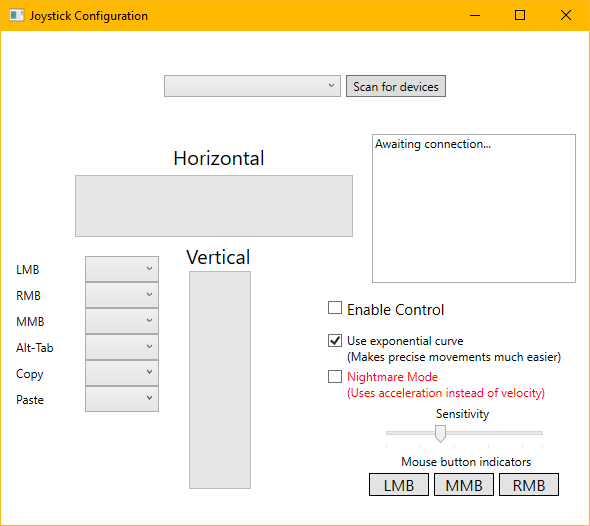
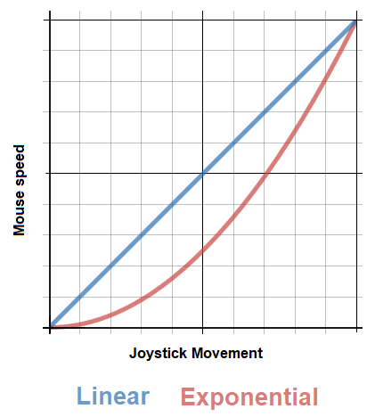

# JoystickMouseControl
Lets you control your mouse using a HOTAS Joystick. I should mention that this likely serves no practical applications; it's just for fun.

## Overview of the interface
When you open the app, click the "Scan for devices" button. Any joysticks found will appear in the list next to the button, where you can select one. The bars will start updating to reflect the position of the joystick.

Once you've done that, you can setup what buttons on the joystick control things like left/right/middle mouse clicks, along with a few other keyboard shortcuts. There are some preview indicators for the mouse buttons in the bottom right so you know its reading the right buttons.

Finally, click the "Enable Control" box to allow the software to control your mouse and keyboard.

### Additional options
"Use exponential curve" switches between using an exponential and linear interpolation curve. An exponential curve give you more detail in the fine movements, which makes it much easier to position the cursor accurately.
A linear curve means that the amount of travel on the stick is directly proportional to the amount of speed you get.

"Nightmare Mode" disables the cursor from automatically stopping when you let go of the joystick. This is a closer simulation of a plane, as you need to stop the movement yourself. This is mostly for fun, hence the silly name. It is very amusing watching your cursor fly uncontrollably across the screen!

## How can I download it?
On the right there is a section titled "Releases". There you can find a .zip containing the app and the things it needs to run. Extract the contents to a folder and run the .exe. If you get a warning about "Windows protected your PC", that is because Microsoft has absolutely no idea what this is and therefore warning you about it. Clicking "More info" then "Run anyway" dismisses the warning.